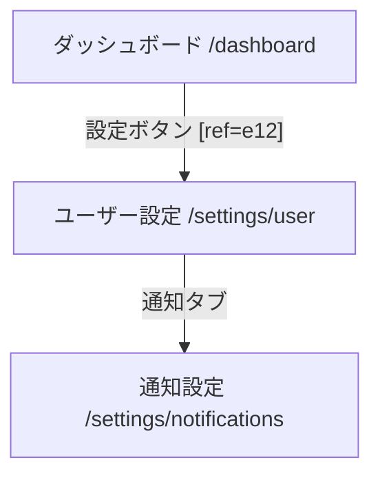

# Phase 1: フロントエンド仕様抽出とUI/UX自動評価

## このドキュメントの使い方

実装時の技術リファレンス。各節がロードマップのどのPhaseで使えるかを示す。

| 節 | 技術 | 使うPhase |
|---|---|---|
| §1 静的解析 | `pages/` 解析 → ルートマップ・Mermaid遷移図 | **Phase 0** |
| §2 動的キャプチャ | `ariaSnapshot()` → DOM走査・AOM生成 | **Phase 0** |
| §3 AI UX評価 | Midscene.js / UI-Tars / GPT-4o | Phase 1 |
| §4 GraphRAG | Nested JSON-LD + Neo4j | Phase 2〜3 |

> **注**: careeconのFEはVue.js。§1のAST解析の記述はNext.js向けだが、  
> `pages/` ディレクトリ解析・APIクライアント静的解析の考え方はそのまま適用できる。

---

## 概要

SaaSプロダクトの開発・CS対応をAIで完全自動化するには、LLMがFEの仕様・UI状態・画面遷移トポロジーを人間と同等以上の解像度で理解できる基盤が必要。  
本フェーズは以下の4領域でその基盤を設計する。

```
静的解析 → 動的キャプチャ → AI UX評価 → GraphRAG格納
```

---

## 1. 静的解析による画面遷移・仕様の抽出

### 課題

React / Next.js はCSR・SSR・SSGが混在するコンポーネント指向のフレームワークであり、単純なディレクトリトラバーサルでは画面遷移図を生成できない。

### 推奨アプローチ：AST解析パイプライン

**Tree-sitter または TypeScript Compiler API** を用いた独自ASTパーサーパイプラインを構築する（Sirens Call の手法を応用）。

#### 処理ステップ

1. **第1パス** — 関数宣言をインデックス化して重複排除
2. **第2パス** — `<Link href="...">` と `router.push()` の呼び出し箇所をBFSで特定
3. **出力** — Mermaidフォーマットの画面遷移図 + Markdown形式のコンポーネント仕様



各ノードには以下をMarkdownで付与し、LLMがマクロ（遷移構造）とミクロ（データ構造）を同時に把握できるようにする：

- Propsの型定義（TypeScriptインターフェース）
- 状態管理の要約（`useState` / Redux 等）

**メリット** — アプリ実行なしにCI/CD上で全体構造を瞬時に抽出可能。テストカバレッジに依存せず全ルートを網羅。Mermaid形式はLLMのネイティブな推論能力と合致。

**デメリット** — APIレスポンス依存の動的URLパラメーターはランタイムなしに完全解決不可。

### 比較検討

| 手法 | メリット | デメリット |
|---|---|---|
| Tree-sitter（Sirens Call応用） | 高速・多言語対応・Mermaid出力特化 | フレームワークごとのASTクエリ保守コストが高い |
| Next.js Sitemap API | 導入容易・フレームワーク標準機能を流用 | URLの平坦なリストのみ・遷移エッジ（有向グラフ）は取得不可 |
| Babel / TypeScript Compiler API | React/TS親和性が高く型の解決も可能 | コンパイルプロセスへの介入でビルド時間に影響 |

---

## 2. E2Eツールによる動的状態キャプチャとデータ軽量化

### 課題

静的解析で得られるのは「設計図」のみ。APIレスポンス後の状態やユーザーインタラクションによる動的DOMを理解させるにはランタイムキャプチャが必要。  
最大の技術課題は **生のHTML/DOM（トークン消費が膨大）をいかに軽量化するか**。

### 推奨アプローチ：AOM + スクリーンショットのハイブリッドキャプチャ

#### AOM（アクセシビリティオブジェクトモデル）の活用

Playwright の `page.ariaSnapshot()` でDOM→YAML変換し、**トークン数を最大90%削減**する。

```
【生DOM（数千トークン）】               【AOM YAML（200〜400トークン）】
<div class="form-group tw-flex ...">   - heading "ログイン"
  <div class="...">                    - textbox "メールアドレス" [ref=e1]
    <input type="email" .../>          - textbox "パスワード" [ref=e2]
    <input type="password" .../>       - button "ログイン" [ref=e3]
    <button class="btn ...">           - link "パスワードを忘れた方" [ref=e4]
```

`[ref=e5]` の一意な参照IDにより、LLMがCSSセレクタ不要で決定論的なDOM操作を推論できる。

#### DOMノイズ除去：D2Snap アルゴリズム

複雑なSaaS UIには D2Snap の概念を適用する：

- セマンティックスコア $m \in [0, 1]$ を設定
- スコアが閾値 $m$ を下回る属性（不要な `class`・`style`・汎用的な `data-*`）を再帰的に枝刈り
- UIの構造的完全性を維持しながらトークンコストを最小化

#### 実装例（TypeScript）

```typescript
import { chromium, Page } from 'playwright';
import * as fs from 'fs';
import * as path from 'path';

interface UIStateKnowledge {
  url: string;
  title: string;
  screenshotPath: string;
  ariaSnapshotYaml: string;
  timestamp: string;
}

async function captureUIState(
  page: Page,
  outputDir: string,
  snapshotName: string,
): Promise<UIStateKnowledge> {
  // SaaS特有の非同期データロードを待機
  await page.waitForLoadState('networkidle');

  fs.mkdirSync(outputDir, { recursive: true });

  // マルチモーダルLLM評価用のフルページスクリーンショット
  const screenshotPath = path.join(outputDir, `${snapshotName}.png`);
  await page.screenshot({ path: screenshotPath, fullPage: true });

  // AOM（YAML形式）抽出 — CSSノイズを排除したセマンティック構造のみ
  const ariaSnapshotYaml = await page.ariaSnapshot();

  const knowledgeData: UIStateKnowledge = {
    url: page.url(),
    title: await page.title(),
    screenshotPath,
    ariaSnapshotYaml,
    timestamp: new Date().toISOString(),
  };

  // RAGソース用メタデータをJSON出力
  fs.writeFileSync(
    path.join(outputDir, `${snapshotName}.json`),
    JSON.stringify(knowledgeData, null, 2),
  );

  return knowledgeData;
}

(async () => {
  const browser = await chromium.launch({ headless: true });
  const context = await browser.newContext();
  const page = await context.newPage();
  try {
    await page.goto('https://example.saas.com/dashboard');
    const knowledge = await captureUIState(page, './knowledge_base', 'dashboard');
    console.log(knowledge.ariaSnapshotYaml);
  } finally {
    await browser.close();
  }
})();
```

**メリット** — トークン消費を最大90%削減。`ref` による決定論的要素マッピングで安定操作。標準Playwright APIで実装・保守が容易。

**デメリット** — ARIA属性が適切に実装されていないレガシーUIでは情報欠損リスクあり。絶対座標や `z-index` 等の視覚スタイリング情報は含まれない。

### 比較検討

| 手法 | メリット | デメリット |
|---|---|---|
| Playwright `ariaSnapshot` | 公式サポート・圧倒的トークン効率・`ref` による決定論的操作 | 不適切なHTML実装では情報欠損 |
| Lightpanda Native MCP | CDPを経由しないため超高速・真のイベントバインディングを確実検知 | Zigベースエンジン導入コストあり |
| D2Snap（アルゴリズム） | DOM構造を保持しつつトークン最適化 | フレームワークごとの微調整が必要 |
| Readability.js + Turndown | 文書コンテンツ処理に優れる | 複雑なSaaS UIダッシュボードには不向き |

---

## 3. マルチモーダルAIによるUI/UXヒューリスティック評価

### 推奨アプローチ：評価エンジンの使い分け

| シナリオ | 推奨エンジン |
|---|---|
| データプライバシー優先 / 微細な要素ローカリゼーション | UI-Tars（ローカルホスト） |
| 高度なUX理論推論 / ヒューリスティック評価の深さ | GPT-4o |
| CI/CDへの自動テスト統合 / セレクタ保守コスト削減 | Midscene.js |

#### ツール概要

**Midscene.js**  
Vision-Driven UIテストSDK。VLMを用いて自然言語でUI操作を記述し、セレクタ保守コストをゼロにする。Instant Actions機能でオペレーションをキャッシュし、次回の実行速度をネイティブ自動化に近づける。

**UI-Tars**  
Qwen-2.5-VLベースのGUI操作特化オープンソースVLM。ローカル実行可能でデータプライバシーを完全保護。画面要素の視覚的ローカリゼーション精度が高い。

**GPT-4o**（参考研究成果）  
ニールセンの10ヒューリスティクス評価実験では、人間が特定した課題の21.2%を検出しつつ、人間が見落とした **27件の新規課題** を独立発見。静的・視覚的評価に強く、動的文脈（柔軟性・効率性）ではハルシネーションが発生しやすい。

### 最適化プロンプト設計

AOM YAML とスクリーンショットをクロスリファレンスさせ、**JSONスキーマ出力を強制**する。

```
【役割】
HCI世界的専門家として、提供された「UIスクリーンショット（視覚・レイアウト情報）」と
「アクセシビリティツリーYAML（セマンティック・構造情報）」をクロスリファレンスし、
SaaSプロダクトのUI/UXを評価する。

【評価基準】
- ヤコブ・ニールセンの10のヒューリスティクス
- WCAG 2.1 アクセシビリティガイドライン

【評価観点】
- 視覚的評価: ボタンのコントラスト・余白・情報の階層性（スクリーンショットから推論）
- 構造的評価: 適切なARIAロールの欠如・フォームラベルの欠落（YAMLから推論）

【制約】
「柔軟性と効率性」など複数画面にまたがる動的文脈の推論は、確証がない限り行わない。

【出力形式】
Severity 2以上の課題のみ、以下の厳密なJSONスキーマで出力する。
説明文は一切含めず、Markdownコードブロック（json）のみを出力する。

{
  "ux_evaluations": [
    {
      "heuristic": "ヤコブ・ニールセンの原則名",
      "severity": 1〜4,
      "element_ref": "AOM内のrefID（例: e5）",
      "finding": "発見した課題の説明",
      "recommendation": "改善提案"
    }
  ]
}
```

このプロンプトにより、「スクリーンショットではボタンに見えるが、YAML上では単なる `<div>`（`role="button"` が欠如）」という視覚では見落としがちなアクセシビリティ欠陥を論理的に発見できる。

**メリット** — 視覚的UX評価とアクセシビリティ評価を同時自動化。JSON強制出力でGraphRAGへのパイプライン処理がシームレス。

**デメリット** — 偽陽性（False Positives）が一定確率で発生。最終トリアージにはHuman-in-the-loopが必要。

### 比較検討

| エンジン | メリット | デメリット |
|---|---|---|
| Midscene.js | セレクタ不要・キャッシュによる実行速度最適化 | 大量ステップ時のVLM呼び出しコストとレイテンシが増大 |
| UI-Tars | ローカル実行・データプライバシー完全保護 | 高度なUX理論推論では商用モデルに一歩譲る |
| GPT-4o | 人間とは異なる視点での新規課題発見能力に長ける | 動的コンテキスト推論でハルシネーションが発生しやすい |

---

## 4. LLM向けナレッジベースの構造化設計（GraphRAG）

### ベクトル検索の限界

純粋なRAGでは「ユーザー設定」と「通知設定」がベクトル空間で類似するため、LLMが「ダッシュボード→ユーザー設定への遷移手順」と「通知設定への遷移手順」を混同してハルシネーションを起こす。  
**UIの「状態トポロジー（A画面のボタンXでB画面へ）」という空間的関係性がベクトル化によって破壊される**のが根本原因。

### 推奨アプローチ：GraphRAG + Nested JSON-LD

Neo4j / PuppyGraph 等のグラフDBで、エンティティをノード・関係を有向エッジで保持する。  
ベクトル検索でノードを特定した後、エッジをトラバースして正確な最短経路を導出する。

```json
{
  "@context": "https://schema.org/",
  "@type": "SoftwareApplication",
  "name": "SaaS Product X",
  "version": "1.4.0",
  "screens": [
    {
      "@id": "screen:dashboard",
      "@type": "WebPage",
      "urlPattern": "/dashboard",
      "description": "ログイン後に表示されるメイン画面。KPIメトリクスとナビゲーションを提供。",
      "accessibilityTree": "- heading \"ダッシュボード\" [ref=h1]\n- button \"設定\" [ref=e12]",
      "uxEvaluations": [
        {
          "heuristic": "システム状態の視認性",
          "severity": 2,
          "element_ref": "e12",
          "finding": "ローディング中のフィードバックがない",
          "recommendation": "スピナーまたはスケルトンUIを追加する"
        }
      ],
      "outboundTransitions": [
        {
          "triggerElementRef": "e12",
          "triggerLabel": "設定ボタン",
          "targetScreenId": "screen:user_settings"
        }
      ]
    },
    {
      "@id": "screen:user_settings",
      "@type": "WebPage",
      "urlPattern": "/settings/user",
      "description": "ユーザーの個人情報・パスワード・通知設定を管理する画面。"
    }
  ]
}
```

**設計のポイント**

- `@id` による一意URIで、LLMが多段ホップ推論を決定論的に実行できる
- `outboundTransitions` 内で `targetScreenId` として別ノードを明示的に参照
- 各ノードに自然言語 `description` を持たせることで **ベクトル検索 + グラフ探索のハイブリッド検索** が実現
- Graph Pruner で空ノード・デッドリンクを自動枝刈りして整合性を維持

**メリット** — 「A画面のボタンXを押すとB画面」という空間的依存関係を正確に保持。CS対応AIの「存在しないボタンを案内する」系ハルシネーションを排除。

**デメリット** — スキーマ設計・データインジェスト・Cypherクエリ生成の実装難易度が高い。

### 比較検討

| アーキテクチャ | メリット | デメリット |
|---|---|---|
| GraphRAG（Neo4j / PuppyGraph） | 論理的な依存関係・最短経路を正確に保持・高精度な多段ホップ推論 | 構築・保守が複雑・グラフクエリ生成レイヤーの実装が必要 |
| 純粋なVector DB（Pinecone等） | 構築容易・類似コンポーネントのセマンティック検索に強い | トポロジー消失・複数画面仕様の混同ハルシネーションが発生 |
| ドキュメントDB（MongoDB等） | JSONをそのまま格納・WebエンジニアにFamiliar | 階層を跨いだ関係性の動的抽出が困難 |

---

## 総合結論

| レイヤー | 採用技術 |
|---|---|
| 静的解析 | Tree-sitter / TSC API → Mermaid遷移図 + Markdown仕様 |
| 動的キャプチャ | Playwright `ariaSnapshot()` + フルページスクリーンショット |
| UX評価 | Midscene.js + UI-Tars / GPT-4o + JSON強制プロンプト |
| ナレッジ基盤 | Neo4j / PuppyGraph GraphRAG + Nested JSON-LD |

この自律的フロントエンド品質管理システムをCI/CDに組み込むことで、コードのPushのたびにAIがUIの仕様を自動読み取り、ナレッジグラフを最新状態に同期し、UX劣化をプロアクティブに検知する **「自己言及型アーキテクチャ」** が実現する。
